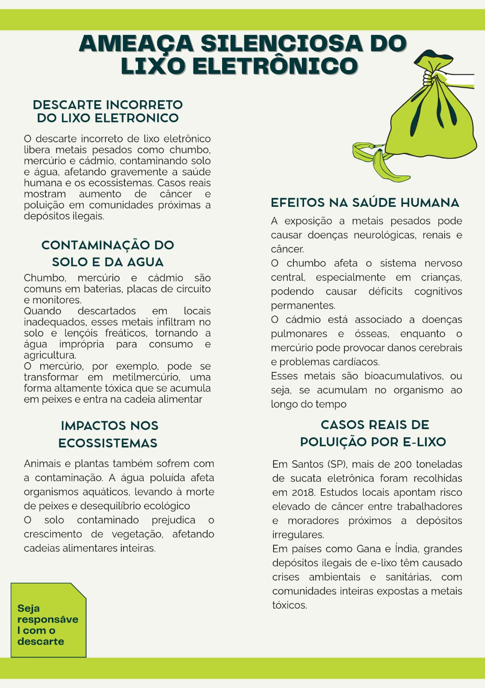

# ♻️ Ameaça Silenciosa: Conscientização sobre Lixo Eletrônico

> **Tema:** Ameaça Silenciosa do Lixo Eletrônico
> **Tipo de Entrega:** Infográfico Informativo

## 📄 Sobre a Atividade
Esta atividade teve como objetivo pesquisar e sintetizar informações cruciais sobre o descarte incorreto de Resíduos de Equipamentos Elétricos e Eletrônicos (REEE), popularmente conhecido como **Lixo Eletrônico**.

Como futuros profissionais de tecnologia, é nossa responsabilidade entender o ciclo de vida dos dispositivos que produzimos e utilizamos, bem como os impactos devastadores do descarte irresponsável.

## 🖼️ O Infográfico Produzido

## 🌍 Tópicos Abordados

Com base na pesquisa realizada, o material destaca quatro pontos críticos:

### 1. Contaminação Ambiental ☠️
O descarte em lixões comuns libera metais pesados (**Chumbo, Mercúrio e Cádmio**) presentes em baterias e placas de circuito.
*   **Impacto:** Infiltração no solo e contaminação de lençóis freáticos.
*   **Bioacumulação:** O mercúrio, por exemplo, transforma-se em metilmercúrio, entrando na cadeia alimentar e tornando a água imprópria.

### 2. Impactos na Saúde Humana 🏥
A exposição a esses componentes tóxicos gera riscos severos:
*   **Chumbo:** Afeta o sistema nervoso central (risco crítico para o desenvolvimento cognitivo de crianças).
*   **Cádmio:** Associado a doenças pulmonares e ósseas.
*   **Mercúrio:** Pode provocar danos cerebrais e cardíacos.
*   **Geral:** Aumento de casos de câncer e doenças neurológicas em comunidades próximas a depósitos irregulares.

### 3. Desequilíbrio dos Ecossistemas 🌿
*   Morte de peixes e organismos aquáticos.
*   Prejuízo ao crescimento da vegetação devido ao solo contaminado.

### 4. Casos Reais e Dados 📊
*   **Santos (SP - 2018):** Mais de 200 toneladas de sucata recolhidas, evidenciando o volume de lixo gerado em centros urbanos.
*   **Cenário Global:** Países como **Gana e Índia** sofrem com depósitos ilegais massivos, gerando crises sanitárias para as populações locais.

## 🧠 Conclusão e Green IT
Este estudo reforça a importância da **TI Verde (Green IT)**. A solução passa por:
1.  Design de produtos mais duráveis (combate à obsolescência programada).
2.  Logística Reversa eficiente.
3.  Descarte em pontos de coleta especializados e certificados.

## 🛠️ Ferramentas Utilizadas
*   **Pesquisa:** Levantamento de dados sobre toxicologia e casos ambientais.
*   **Design:** Canva / Ferramenta Gráfica para estruturação visual.

---
