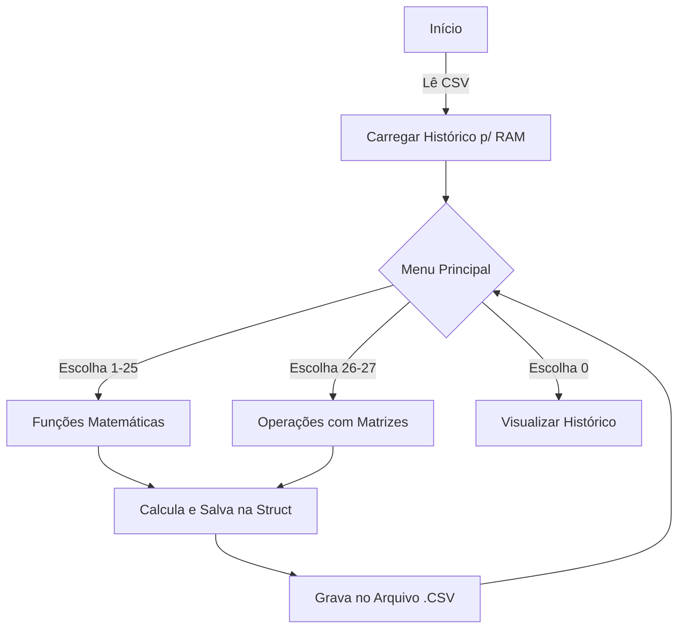

# 🧮 Calculadora Científica Completa em C

> **Status:** ✔️ Concluído | **Versão:** 2.0 (Com Matrizes e CSV)

## 📄 Sobre o Projeto
Este projeto é uma **Calculadora Científica Avançada** desenvolvida em Linguagem C. Diferente de calculadoras simples, esta aplicação implementa estruturas de dados complexas, alocação dinâmica de memória e persistência de dados.

O software oferece **27 operações diferentes**, variando desde aritmética básica até álgebra linear com matrizes e equações de segundo grau, mantendo um registro detalhado de todas as operações em um arquivo **CSV**.

## ⚙️ Funcionalidades Principais

### 1. Operações Matemáticas
*   **Aritmética:** Adição, Subtração, Multiplicação e Divisão (com suporte a múltiplos números via alocação dinâmica).
*   **Trigonometria:** Seno, Cosseno, Tangente e seus inversos (Arc), com conversão automática de graus/radianos.
*   **Funções Avançadas:** Potência, Raízes (Quadrada/Cúbica), Logaritmos (Base 10 e Natural), Fatorial e Hipotenusa.
*   **Algoritmos Específicos:** Teorema de Pitágoras e Fórmula de Bhaskara (com análise de Delta).

### 2. Álgebra Linear (Matrizes)
*   **Manipulação 3x3:** Leitura, impressão, soma e multiplicação de matrizes tridimensionais.

### 3. Sistema de Histórico e Persistência
*   **Structs:** Uso de estruturas (`typedef struct`) para organizar os dados na memória RAM.
*   **Arquivo CSV:** O histórico é salvo em `historico.csv` (Comma-Separated Values), permitindo que os dados sejam abertos posteriormente no Excel ou carregados novamente pelo programa ao iniciar.
*   **Carregamento Automático:** Ao abrir o programa, ele lê o arquivo CSV e restaura o histórico anterior.

## 🏗️ Arquitetura e Tecnologias

O código demonstra domínio sobre conceitos avançados de C:

*   **Ponteiros e Malloc:** Utilizados nas funções de soma, subtração e multiplicação para criar arrays do tamanho exato que o usuário precisa, otimizando o uso de memória.
*   **Modularização:** Funções específicas para cada operação matemática, mantendo o `main` limpo e focado no menu.
*   **Manipulação de Arquivos (`FILE*`):** Leitura (`r`) e Escrita (`w`) de dados estruturados.

💻 Exemplo de Código (Persistência)
Abaixo, um trecho de como o programa salva os dados formatados em CSV, tratando strings para evitar erros de formatação:
code
C
void salvarHistoricoEmArquivo(){
    FILE *arquivo = fopen("historico.csv", "w");
    
    // Cabeçalho do CSV
    fprintf(arquivo, "ID, Tipo, Numero1, Numero2, Resultado\n");
    
    for(int i = 0; i < numeroDeOperacoes; i++){
        // Lógica para substituir espaços por hífens para não quebrar o CSV
        char tipoSemEspacos[50];
        strcpy(tipoSemEspacos, historicoArray[i].tipo);
        
        fprintf(arquivo, "%d, %s, %g, %g, %g \n",
            historicoArray[i].id,
            tipoSemEspacos,
            historicoArray[i].a,
            historicoArray[i].b,
            historicoArray[i].resultado
        );
    }
    fclose(arquivo);
}

# 🛠️ Bibliotecas Utilizadas

# 🚀 Como Compilar e Executar
* Baixe o arquivo main.c.
* Abra o terminal na pasta do arquivo.
* Compilar (Linux/GCC):
* Necessário linkar a biblioteca math (-lm).
* code
* Bash
* gcc main.c -o calculadora -lm
* Executar:
* code
* Bash
* ./calculadora  # Linux/Mac
* calculadora.exe # Windows

# Desenvolvido por Ector Carvalho, Erick Bruno, Leonardo Teles, Talisom Izidoro
