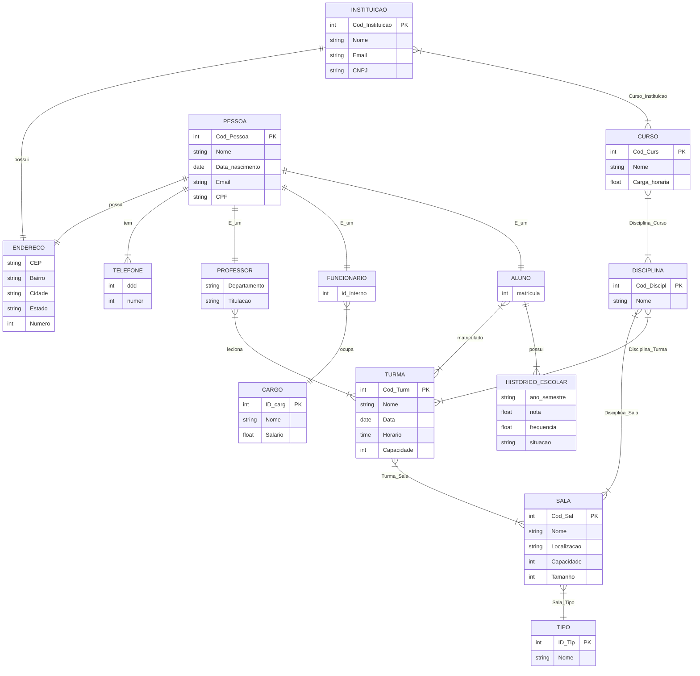

# 🏛️ Modelagem de Dados: Sistema de Gestão Acadêmica

> **Status:** ✔️ Modelo Conceitual Finalizado
> **Ferramenta:** brModelo

## 📄 Descrição do Projeto
Este projeto consiste na modelagem conceitual (Diagrama Entidade-Relacionamento) de um sistema para gerenciamento de uma instituição de ensino.

O objetivo do banco de dados é centralizar informações sobre o corpo docente, discente, administrativo, além de gerenciar a estrutura pedagógica (cursos e disciplinas) e física (salas e turmas) da instituição.

## 🎨 Diagrama Conceitual (Mermaid)

🎨 Diagrama Visual (brModelo)

#🧩 Estruturas e Entidades
O modelo destaca-se pelo uso de Generalização/Especialização e relacionamentos complexos. Abaixo, os principais grupos de entidades:

# 1. Hierarquia de Pessoas (Herança)
* Foi aplicada uma estrutura de generalização para evitar redundância de dados comuns.
* Pessoa (Entidade Pai): Armazena dados genéricos como Nome, CPF, Data_Nascimento, Email e relacionamentos com Endereço e Telefone.
* Especializações (Entidades Filhas):
* Professor: Possui atributos específicos como Titulação e Departamento.
* Aluno: Relaciona-se com Histórico_escolar e Turmas.
* Funcionário: Relaciona-se com Cargo (que define o salário e função).
# 2. Estrutura Pedagógica
* Instituição: Entidade central que oferta os cursos.
* Curso: Possui Carga_Horaria e contém várias disciplinas.
* Disciplina: Matérias que compõem a grade curricular.
* Turma: A instância real de uma disciplina, ocorrendo em um horário específico.
# 3. Estrutura Física
* Sala: Define o espaço físico (Tamanho, Capacidade, Localização).
* Tipo (de Sala): Categoriza as salas (ex: Laboratório, Sala de Aula, Auditório).
# 🔗 Principais Regras de Negócio Identificadas
* Unicidade de Pessoa: Uma pessoa é cadastrada apenas uma vez, podendo atuar como Professor, Aluno ou Funcionário (dependendo do tipo de especialização adotada).
* Histórico Escolar: O desempenho do aluno (Nota, Frequência, Situação) é registrado por semestre no relacionamento entre Aluno e Turma/Disciplina.
* Alocação de Salas: Cada turma é alocada em uma sala, que por sua vez possui um tipo específico, garantindo que aulas de laboratório não ocorram em salas comuns.
* Cargos e Salários: Os salários não estão atrelados diretamente ao funcionário, mas sim ao Cargo, facilitando atualizações salariais em massa.
# 🛠️ Tecnologias Utilizadas

# 🚀 Como Abrir e Editar
* Para visualizar a imagem, basta acessar este repositório.
* Para editar a estrutura lógica, é necessário possuir o arquivo .brM3 (caso disponível) e utilizar o software brModelo 3.0.
# Desenvolvido por Ector Falcão, Erick Bruno, João Paulo, Luan Rodrigues, Matheus, Michael Fernando, Tiago Mendes
